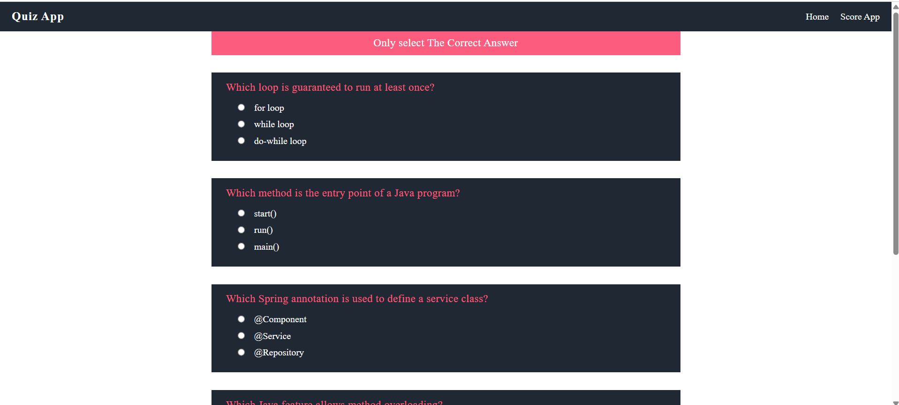
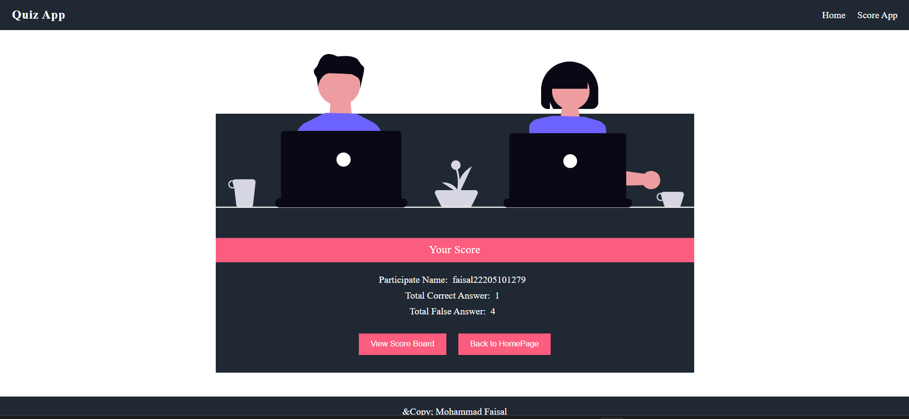

# Quiz App (Spring Boot)

A simple Quiz Application built using Spring Boot.
This project demonstrates Spring Boot fundamentals, REST APIs, and database integration.

---

## ✨ Features
- Create and manage quiz questions
- Multiple choice questions
- Automatic score calculation
- Database integration using Spring Data JPA

---

## 🛠️ Technologies Used
- Java
- Spring Boot
- Spring Data JPA
- Maven
- MySQL
- IntelliJ IDEA

---

## 📸 Project Screenshots

### 🏠 Home Page

### ❓ Quiz Page

### 🏁 Result Page

---

## 📁 Project Structure

Quiz_App/
├── screenshots/
├── src/
├── pom.xml
└── README.md

---

## ▶️ How to Run the Project
1. Clone the repository
2. Open the project in IntelliJ IDEA
3. Configure database settings in `application.properties`
4. Run `QuizAppApplication.java`
5. Access the app via browser or API tool

---

## 🌿 Branch Information
- `main` → Quiz App without database
- `db-version` → Quiz App with database integration

---

## 👨‍💻 Author
**Mohammad Faisal**  
GitHub: https://github.com/faisal1279

